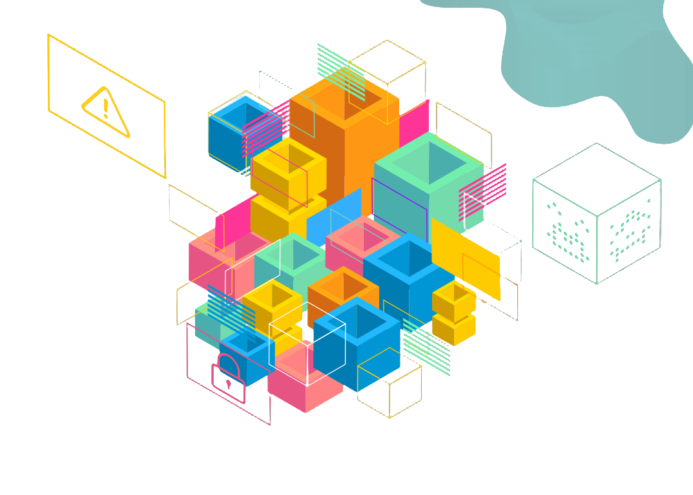
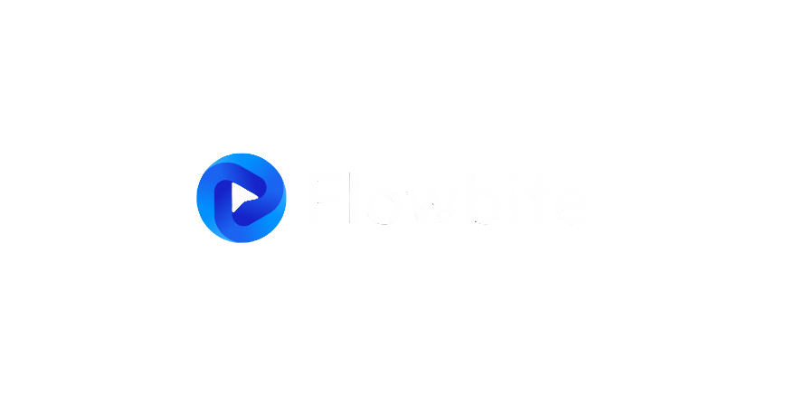
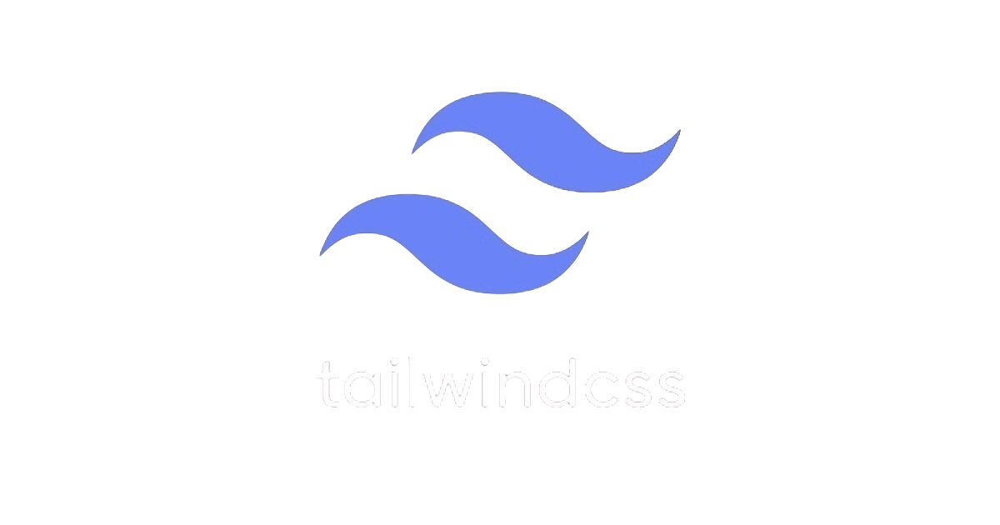
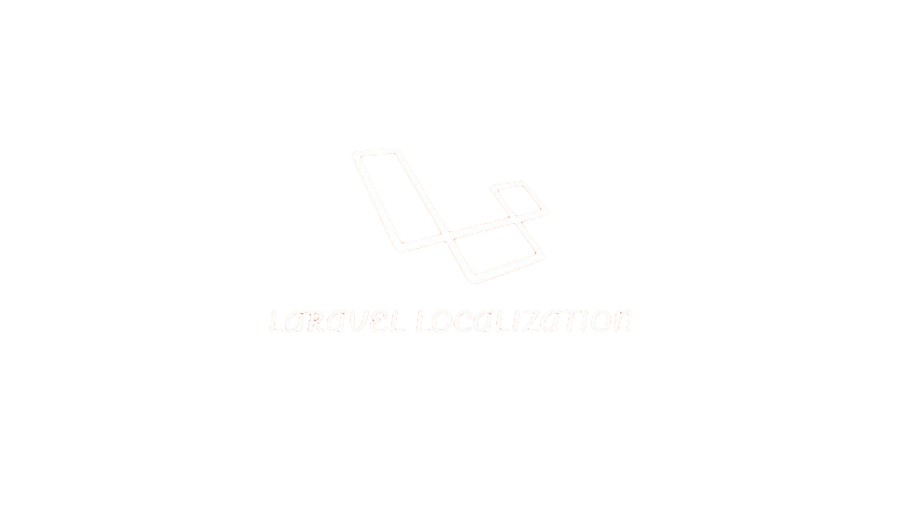
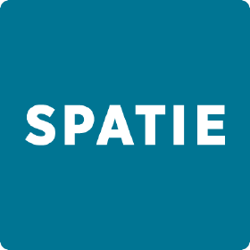
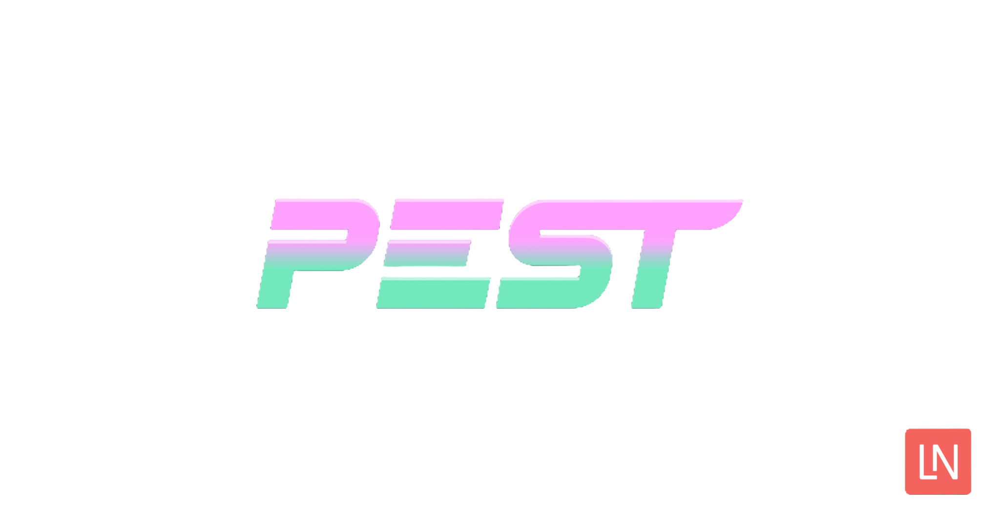
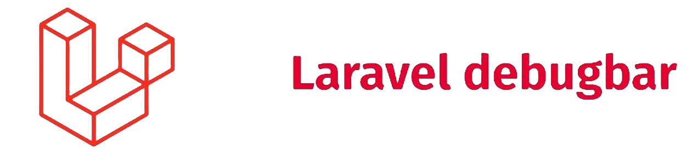

$${\color{violet}NightCloudDynamics}$$  

Est une agence web innovante située à Genève, en Suisse, spécialisée dans la création de sites internet.

Notre atout ? Une compréhension approfondie et novatrice des défis numériques, nous permettant de proposer des solutions adaptées à tous vos besoins.

Nous élaborons des stratégies digitales et gérons des projets pour des entreprises leaders ainsi que pour des indépendants. Chez NightCloudDynamics, chaque projet digital compte, quelle que soit sa taille. Nous traitons chaque demande avec professionnalisme, proximité et expertise, en privilégiant une relation saine et fondée sur la confiance. Voilà notre engagement !

$${\color{yellow}Dépendance}$$  

La suite du document vous montrera tous les dépendances que nous avons utilisé pour ce projet. 

$${\color{Lightblue}Flowbite}$$  

Flowbite est une bibliothèque d'interface utilisateur que nous utilisons pour plusieurs raisons :

**Efficacité du développement** : Flowbite offre des composants préfabriqués qui accélèrent le développement.

**Consistance de l'interface utilisateur** : Flowbite assure une interface utilisateur cohérente et professionnelle.

**Personnalisable** : Flowbite nous permet d'adapter facilement l'esthétique de nos projets.

**Support et communauté** : Avec un support réactif et une communauté active, Flowbite est un outil fiable.

$${\color{lightblue}TailwindCss}$$  

Tailwind CSS est un autre outil essentiel dans notre boîte à outils de développement. C'est un framework CSS qui priorise l'utilité et qui est hautement personnalisable, ce qui nous permet de construire des designs uniques pour nos clients.

Voici quelques raisons pour lesquelles nous utilisons Tailwind CSS :

**Utilitaire d'abord** : Tailwind CSS adopte une approche utilitaire, ce qui signifie que nous pouvons construire des designs complexes sans quitter notre HTML.

**Personnalisable** : Tout comme Flowbite, Tailwind CSS est extrêmement personnalisable, nous permettant de modifier les designs pour qu'ils correspondent parfaitement à la vision de nos clients.

**Performance** : Tailwind CSS est conçu pour être aussi léger que possible, ce qui signifie que les sites web que nous construisons seront rapides et performants.

**Communauté et support** : Tailwind CSS a une communauté de développeurs engagés et un excellent support technique.

$${\color{orange}Laravel Localization}$$  

Laravel Localization est un package que nous utilisons dans nos projets pour simplifier la gestion des multiples langues. Il est crucial pour nous de fournir des solutions qui correspondent aux besoins de nos clients, et cela inclut la capacité de servir du contenu dans différentes langues.

Voici pourquoi nous utilisons Laravel Localization :

**Gestion facile des langues** : Laravel Localization facilite l'ajout et la gestion de multiples langues dans nos projets, nous permettant de rendre nos applications accessibles à une audience plus large.

**Flexibilité** : Avec Laravel Localization, nous pouvons facilement changer la langue du site en fonction des préférences de l'utilisateur, améliorant ainsi l'expérience utilisateur.

**Integration avec Laravel** : Comme Laravel Localization est spécifiquement conçu pour Laravel, il s'intègre parfaitement à notre processus de développement.

**Support de la communauté** : Laravel Localization bénéficie du soutien de la grande communauté Laravel, ce qui signifie que nous pouvons compter sur de l'aide et des ressources lorsque nous en avons besoin.

$${\color{lightblue}Spatie}$$  

Spatie est un ensemble de packages Laravel que nous utilisons fréquemment dans nos projets. L'un des packages que nous utilisons le plus est Laravel-Permission, qui offre une solution simple et flexible pour gérer les rôles et les permissions dans une application Laravel.

Voici pourquoi nous utilisons Spatie Laravel-Permission :

**Facilité d'utilisation** : Spatie Laravel-Permission offre une interface simple pour gérer les rôles et les permissions dans une application Laravel.

**Flexibilité** : Ce package est conçu pour être flexible, ce qui signifie que nous pouvons facilement l'adapter à n'importe quelle structure d'autorisation que nous devons mettre en place.

**Sécurité** : En utilisant Spatie Laravel-Permission, nous pouvons garantir que chaque utilisateur a uniquement l'accès aux ressources qu'il est autorisé à voir.

**Intégration avec Laravel** : Comme Laravel-Permission est spécifiquement conçu pour Laravel, il s'intègre parfaitement à notre processus de développement.

**Support de la communauté** : Spatie bénéficie du soutien d'une communauté active et d'une documentation complète, ce qui signifie que nous pouvons compter sur de l'aide et des ressources lorsque nous en avons besoin.

$${\color{violet}Pest}$$  

Pest est un framework de tests élégant pour PHP, basé sur PHPUnit. Il offre une expérience de test plus simplifiée et conviviale pour les développeurs, en utilisant une syntaxe plus intuitive et expressive.

Voici pourquoi nous utilisons Pest dans nos projets :

**Simplicité** : Pest simplifie le processus de test en utilisant une syntaxe expressive qui rend les tests plus lisibles et faciles à comprendre.

**Flexibilité** : Pest prend en charge une large gamme de types de tests, y compris les tests unitaires, les tests d'intégration et les tests de bout en bout.

**Intégration avec Laravel** : Pest s'intègre parfaitement avec Laravel, ce qui signifie qu'il se prête bien à notre flux de travail de développement.

**Productivité** : Pest rend le processus de test plus fluide et plus rapide, ce qui augmente notre productivité et nous permet de livrer des projets de haute qualité en moins de temps.

**Support de la communauté** : Tout comme les autres outils que nous utilisons, Pest bénéficie du soutien d'une communauté active, ce qui signifie que nous avons accès à une vaste gamme de ressources et d'assistance lorsque nous en avons besoin.

$${\color{violet}DebugBar}$$  

DebugBar est un outil que nous utilisons pour aider au débogage lors du développement de nos projets. C'est une barre d'outils qui s'affiche dans le navigateur et qui fournit des informations précieuses sur le fonctionnement de l'application.

Voici pourquoi nous utilisons DebugBar :

**Informations de débogage détaillées** : DebugBar fournit une grande quantité d'informations utiles pour le débogage, y compris les requêtes SQL, les informations sur la requête HTTP, les données de session et plus encore.

**Facilité d'utilisation** : DebugBar est facile à installer et à utiliser, ce qui signifie que nous pouvons rapidement commencer à déboguer nos applications.

**Intégration avec Laravel** : Comme DebugBar est spécifiquement conçu pour Laravel, il s'intègre parfaitement dans notre environnement de développement.

**Amélioration de la productivité** : DebugBar nous aide à identifier et à résoudre les problèmes plus rapidement, ce qui nous permet de développer des applications de haute qualité plus rapidement.

**Support de la communauté** : DebugBar, comme les autres outils que nous utilisons, bénéficie du soutien d'une grande communauté, ce qui signifie que nous avons accès à une aide et à des ressources lorsque nous en avons besoin.
